import { Steps } from "@astrojs/starlight/components";
import { LinkButton } from "@astrojs/starlight/components";

## 4. 組み立て

### 4-1. バッテリの接続

<Steps>

1. バッテリーによってコネクタの向きが反対になっていることがあります。コネクタを接続する前に確認を行いましょう。基板上に極性のシルクがかかれています。バッテリの配線は赤色が+極、黒色が-極です。基板のシルクと対応しているか確認してください。

   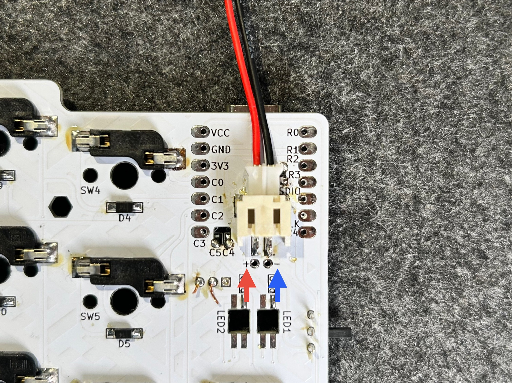

2. バッテリの配線が反対になっていたら、コネクタを付けなおす必要があります。画像を参考に爪楊枝を隙間に差し込み、爪が外れた状態で電線を引き抜きます。2本の電線を抜いたら、差し込む位置を反対にして爪が引っ掛かるまで差し込みます。

   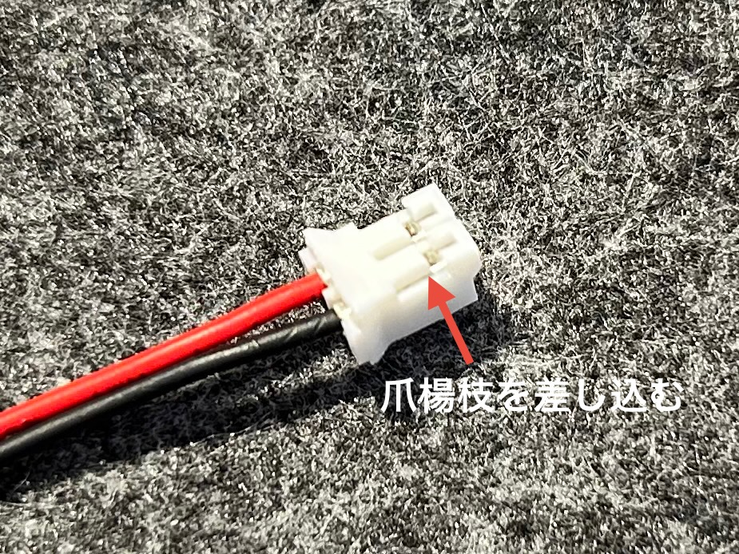

3. バッテリーの配線が正しいことが確認されたらコネクタを接続します。電源スイッチを入れ、マイコンの右上にあるLEDが光ることを確認してください。光ることを確認したら電源はオフにしてください。

   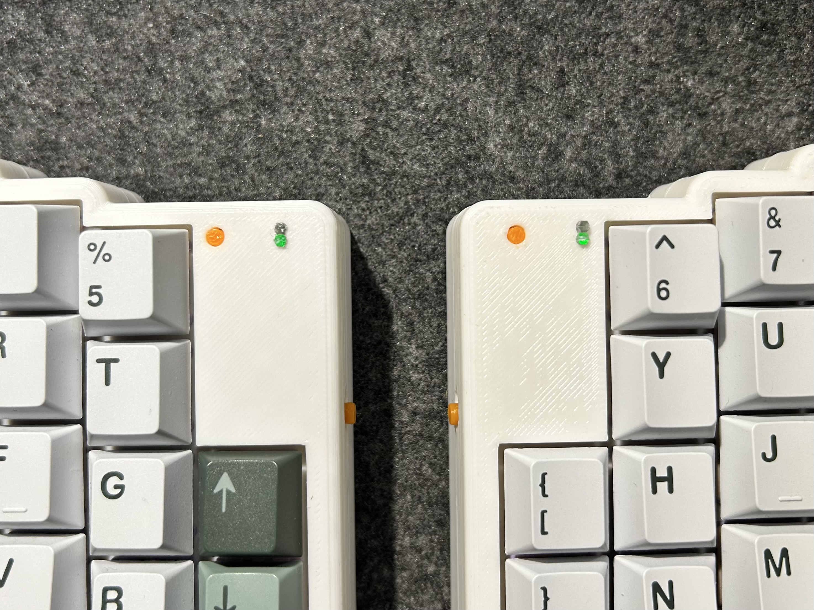

   ケース越しの画像ですが、マイコンの右上が黄色く光っているのがわかります。2回光りますが、バッテリー残量と接続状態を示すライトなのでどの色に光っても正常です。

</Steps>

### 4-2. キット付属ケースの組み立て

右手側のケース組み立て手順をご説明します。左手側、Mackもほぼ同様の手順で組み立てられます。

<Steps>

1. ケース固定用マグネットをトップケース、ボトムケース、トラックボールケースに圧入します。マグネットが入らない場合は2mmのドリルやマイナスドライバで穴を拡張します。緩く、マグネットが抜けてしまう場合は接着剤を穴に少量入れて固定してください。
   :::note[ボトムケースのトラックボール固定用マグネット]
   ボトムケースのトラックボール固定用マグネットは25mmボールと35mmボールで配置が異なります。トラックボールケースをボトムケースに当てはめてみて適切なマグネットの位置を探してください。
   :::
   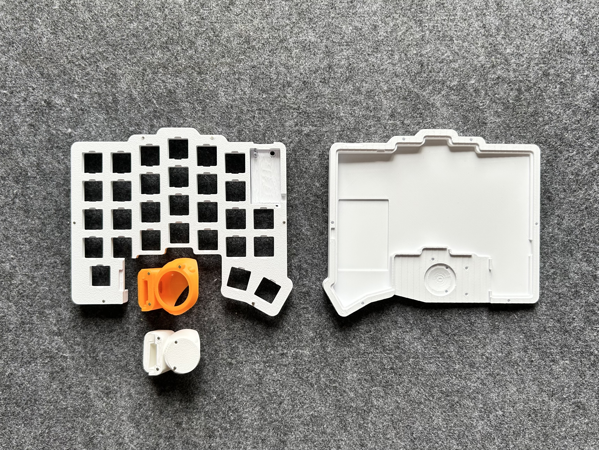
2. セラミックボール3つをトラックボールケースに圧入します。固いものを押し当てることで簡単に圧入することができます。
   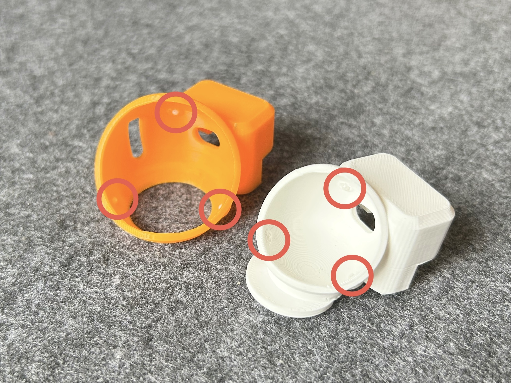
3. トップケースにリセットスイッチと電源スイッチカバーを配置します。
   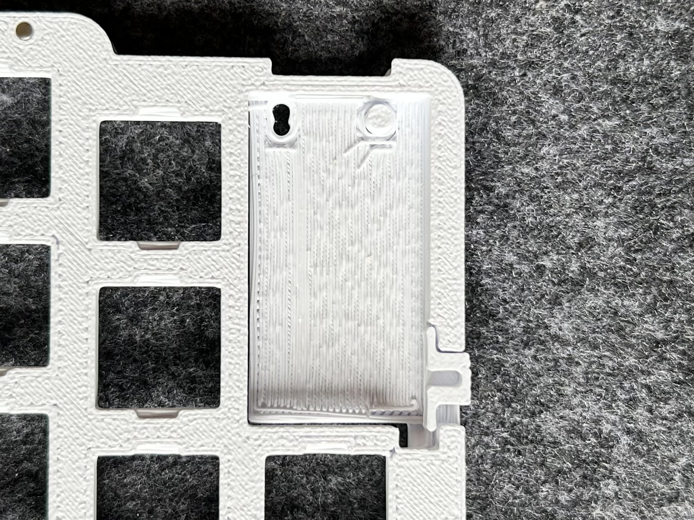
4. PCBをトップケースにはめ込む。この時USB端子と電源スイッチを先にケースに入れるようにします。また、リセットスイッチが抜けないよう逆さにしたまま作業します。
   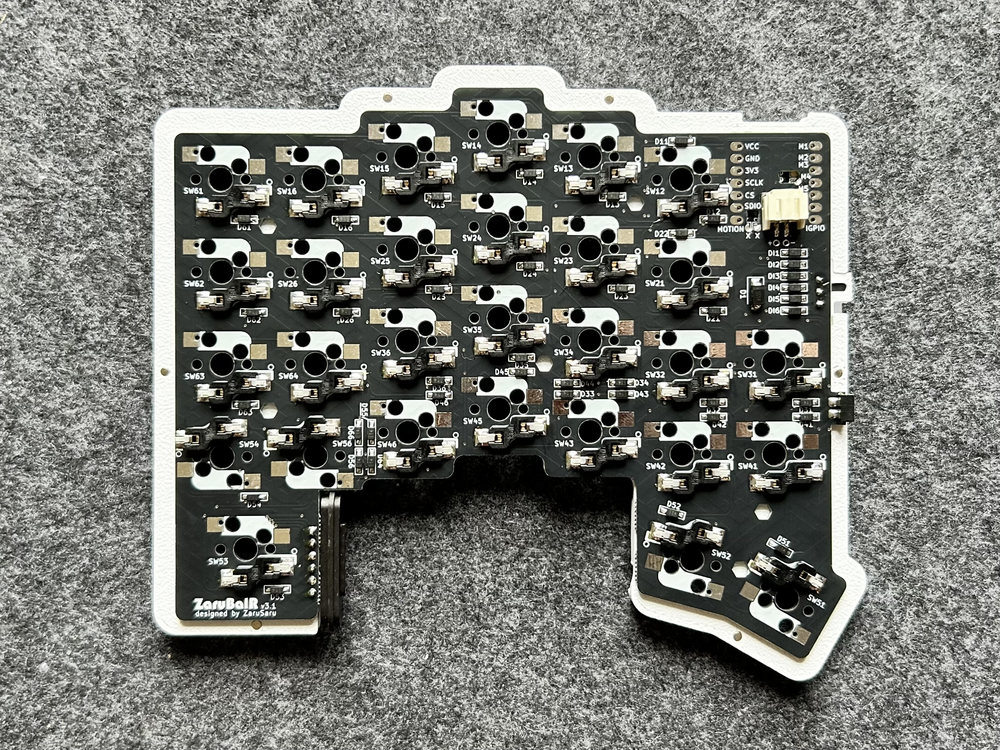
5. 四隅にスイッチをはめて、PCBとトップケースを固定します
   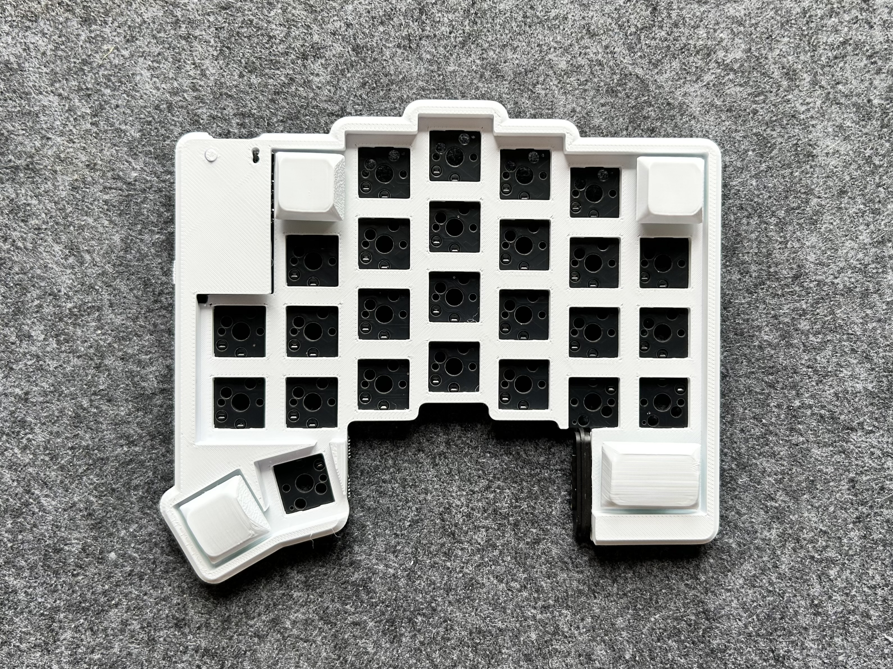
6. ゴム足をボトムケースに貼付します。ゴム足固定用のくぼみがあるのでそこに合わせて貼り付けてください。
   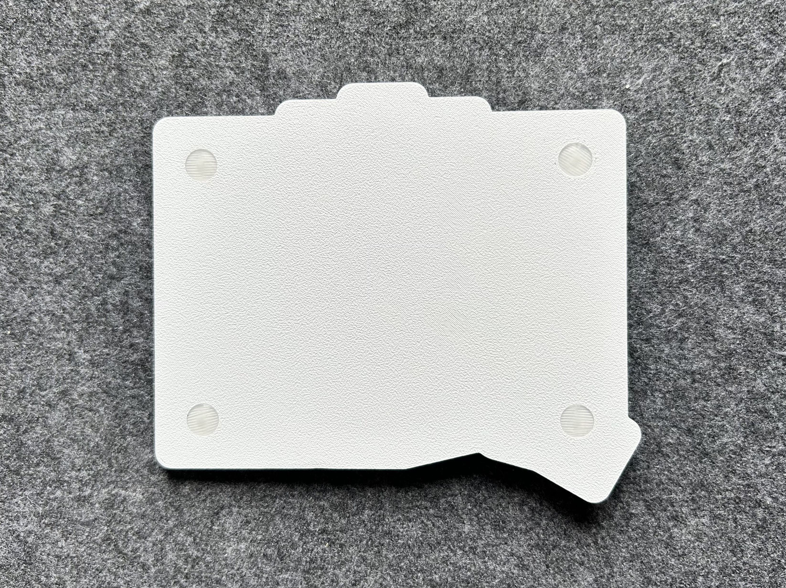
7. ボトムケースにMack接続用のΦ6mmマグネットを接着します。接続先のマグネットと吸着する向きにしてください。(最新版はマグネットの固定位置が画像と若干異なっています)
   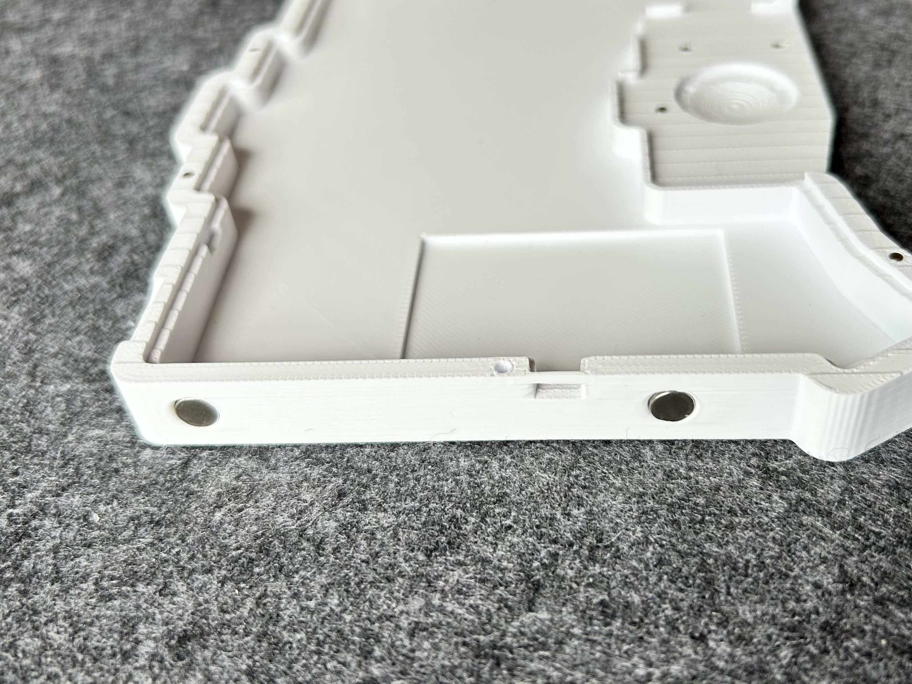
8. バッテリをボトムケースにマスキングテープ等で固定します。くぼみがあるのでそこにバッテリーを配置してください。
   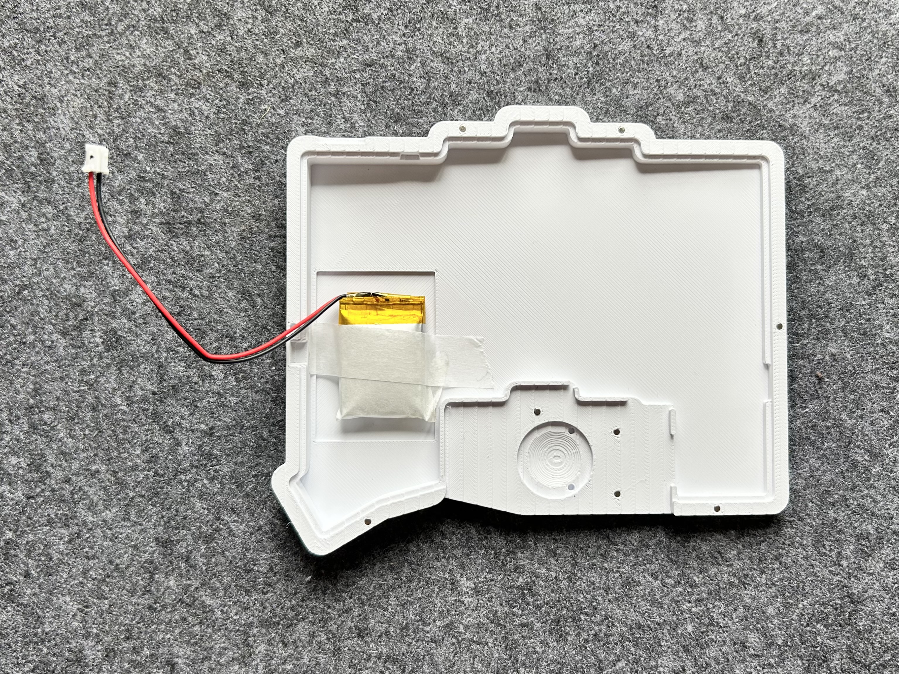
9. バッテリコネクタを接続し、ボトムケースとトップケースをマグネットで固定します。
10. すべてのスイッチとキーキャップ、トラックボール、ノブを取り付けます。
11. トラックボール基板のマグネットコネクタをPCBと接続し、トラックボール基板の上からトラックボールケースを被せます。
    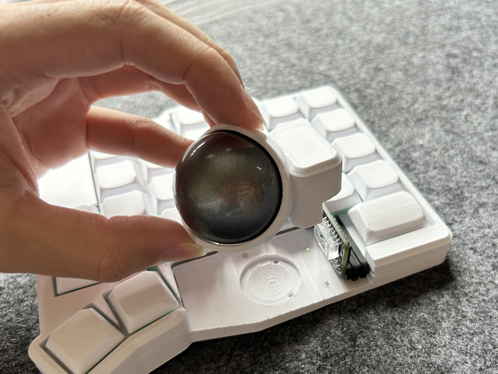
12. マイコンのインジケータLEDの確認穴に2mmのアクリル丸棒を差し込むことで光が拡散し見やすくなります。LEDが見にくい場合は御自身で調達してください。
    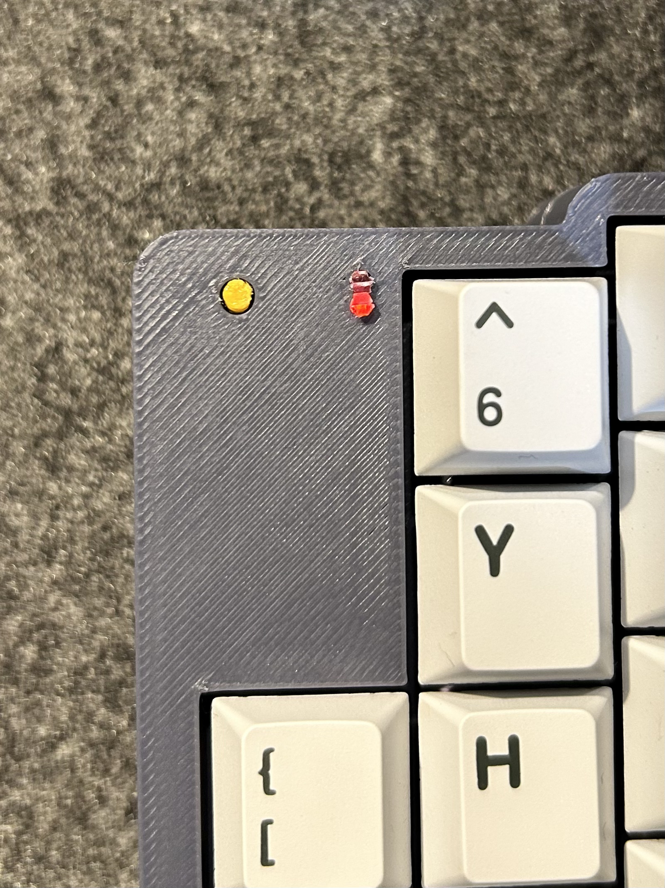

</Steps>

### 4-3. キー入力、マウス操作の動作確認

組み立てが完了したので動作確認をします。まずは電源スイッチをONにしてください。
PCでBluetoothの接続を試してください。ZaruBallというデバイス名で認識されるはずです。

接続したら、メモ帳でキー入力ができるか、トラックボールでマウス操作ができるかを確認してください。
動作確認できない場合は下記のリンク先をご覧ください。

<LinkButton
  href="/ZaruBallv3-docs/build-guide/troubleshoot/"
  variant="secondary"
  icon="document"
>
  トラブルシューティング
</LinkButton>
