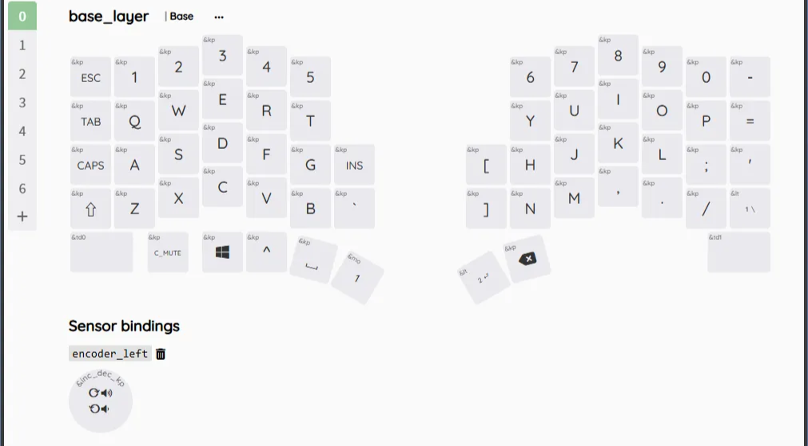
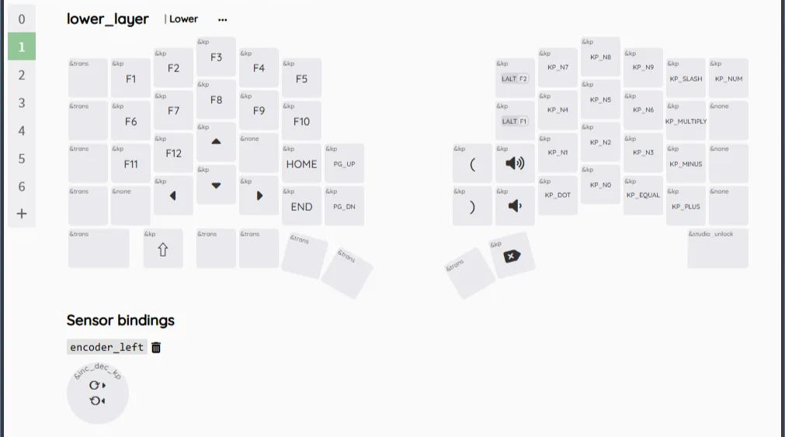
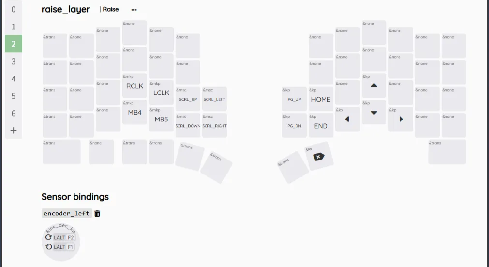
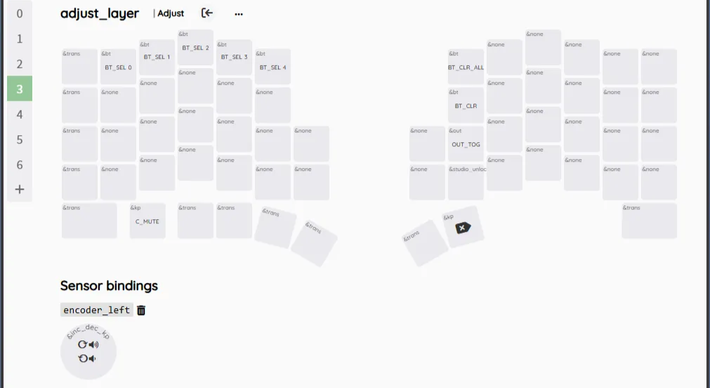
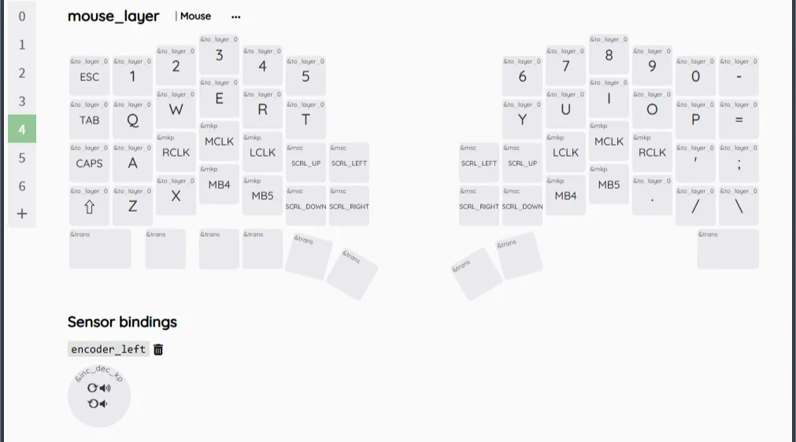

標準ファームウェアのキーマップを紹介します。製作者の環境に最適化されているので、ここから自身の好きなように変更することをお勧めします。

## レイヤー切り替えキー

親指クラスタの最も内側のキーを押すことでレイヤーを切り替えられます。

左手側がレイヤー1へ、右手側をHoldすることでレイヤー2（TapではEnterキー）、同時押しでレイヤー3に切り替わります。また、別レイヤーにはレイヤーキーを押している間のみ移行します(Momentary Layer)。

## Pinkeyのキー割り当て

Pinkeyとは最下段外側の小指の付け根で押す1.5uのキーのことです。

Tap, Hold, ダブルタップ、トリプルタップにそれぞれ異なる機能を割り当てています。

|      | Tap     | Hold | Double tap      | Triple tap      |
| ---- | ------- | ---- | --------------- | --------------- |
| 左手 | IMEオフ | Alt  | &mo 2 (layer 2) | &mo 4 (layer 4) |
| 右手 | IMEオン | Ctrl | &mo 2 (layer 2) | &mo 5 (layer 5) |

## Layer 0 : base_layer

デフォルトのレイヤーです。通常の文字や数字入力に使用します。

親指クラスタにBS、Enterなど文字入力で使用する機会の多いキーを配置しています。

ロータリーエンコーダーは回転でボリューム操作、プッシュでミュートとなっています。

## Layer 1 : lower_layer

Fnキーとテンキーを中心としたレイヤーです。

左手にはFnキーを、右手にはテンキーを配置しています。

Layer 0でBSとなっているキーはLayer1ではDeleteとなっています。

他のレイヤーではトラックボールはカーソル移動となっていますが、Layer 1ではスクロール動作に割り当てています。上下左右全方向にスクロール可能です。通常、Layer1には左手のレイヤーキーによって切り替えますが、右手のみでもスクロール出来ように”/(スラッシュ)”に長押しでLayer 1に移動できるようにしています。

ロータリーエンコーダーは回転で左右矢印、プッシュでShiftとなっています。文字入力中にカーソルの横移動と押しながら回転で文字の選択ができるようにしています。

## Layer 2 : raise_layer

マウス操作を主としたレイヤーです。

トラックボールを動かしている間はLayer 4のmouse_layerに移動するのですが、カーソル移動せずにクリックしたい時のために配置しています。

Layer 1と左右対称になるように矢印キーを配置することで左右どちらの手でも片手で楽に矢印が入力できるようにしています。

ロータリーエンコーダーはAlt+F2やAlt+F1に設定されていますが、これは私の環境での画面明るさ調整用のキーです。Twinkle Trayという外部モニターでも明るさを調整できるソフトを入れ、そのソフトウェアにてマクロを設定しています。デスクトップPCや外部モニターを使用している方にはとてもおすすめです。

## Layer 3 : adjust_layer

Bluetoothの設定を主としたレイヤーです。数字キーで5台の機器との接続を切り替えられます。(ファームウェアをいじればもっと増やすことも出来ます。接続台数を増やしたい方はZMKのドキュメントを参照してください。)

右手側にはBluetoothのクリアや無線と有線接続を切り替えるキーが配置されています。マイコン下の2キーは上からバッテリー残量インジケータの点灯、接続状況インジケータの点灯を行うことができます。

## Layer 4 : mouse_layer

トラックボールを動かしている間に移行するマウスキーを主としたレイヤーです。

左右どちらでもホームポジションでマウスクリックが可能となっており、精密なトラックボール操作が必要な時は左手でマウスキーを押下することができます。

## keymapチートシート

.png>)
