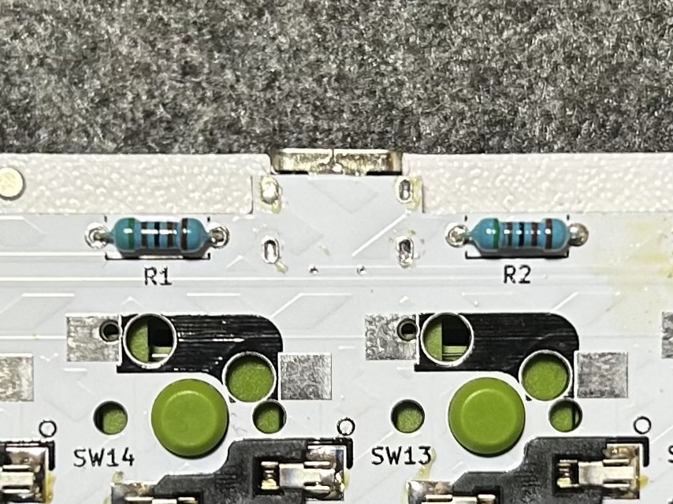
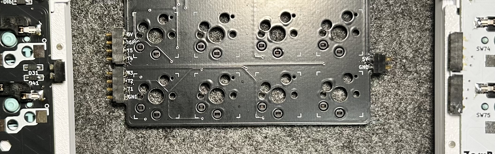
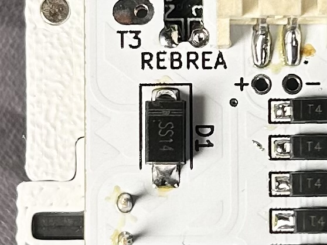

import { Steps, LinkButton } from "@astrojs/starlight/components";

## 1. 部品確認

### 1-1. キット内容

| 名称                          | 数量    | 備考                   |
| ----------------------------- | ------- | ---------------------- |
| Mack基板                      | 1個     |                        |
| SMDダイオード 1N4148W         | 24個    |                        |
| スイッチソケット              | 16個    |                        |
| 5.1kΩ THDダイオード           | 2個     |                        |
| PPTC MINISMDC020F-2           | 1個     |                        |
| USB TypeC ソケット            | 1個     |                        |
| 4ピンポゴピンセット           | 2セット |                        |
| 2ピンポゴピンセット           | 1セット |                        |
| ショットキーダイオード SS14   | 2個     | ZaruBall側にはんだ付け |
| ケース固定用マグネット        | 8個     | Φ2mm,H=2mm             |
| ZaruBall-Mack接続用マグネット | 8個     | Φ6mm,H=2.5mm           |
| Mackトップケース              | 1個     |                        |
| Mackボトムケース              | 1個     |                        |

### 1-2. 別途準備する部品

| 名称         | 数量 | 備考                                                 |
| ------------ | ---- | ---------------------------------------------------- |
| キースイッチ | 16個 | 選択した仕様に合わせてキースイッチを選択してください |
| キーキャップ | 16個 |                                                      |

## 2. 準備

### 2-1. 用意する工具

| 名称               | 備考                         |
| ------------------ | ---------------------------- |
| はんだごて         | 組み立て済み品購入の方は不要 |
| はんだ             | 組み立て済み品購入の方は不要 |
| フラックス         | 組み立て済み品購入の方は不要 |
| ピンセット         |                              |
| マスキングテープ   |                              |
| テスター           | 組み立て済み品購入の方は不要 |
| キーキャッププラー |                              |
| キースイッチプラー |                              |
| 接着剤             |                              |

:::note[はんだ付けオプションをご購入された方]

はんだ付けオプションで購入された方は以下の組み立てから始めてください。

<LinkButton
  href="./#4-キット付属ケースの組み立て"
  variant="primary"
  icon="right-arrow"
>
  キット付属ケースの組み立てへ
</LinkButton>

:::

## 3. 実装

基板にパーツのはんだ付けを行って行きます。

### 3-1. ダイオードの実装

ダイオードは左右のメイン基板裏面、画像に示したフットプリントに実装します。

:::caution[ダイオードの向き]
ダイオードは正しい向きで実装する必要があります。基板のシルクに描かれている三角の先端に描かれた縦線があるほう（上の画像の右側）と、ダイオードに書かれている薄い線がある向きを揃えてください。

:::

<Steps>

1. ダイオード用のパッドのうち片方に予備はんだを盛ります。
2. 左手でピンセットを使いダイオードをつまみます。この時シルクの向きとダイオードの向きが揃っていることを確認します。
3. パッドに盛ったはんだをはんだごてで溶かしながら、ダイオードの位置を調整します。
4. ダイオードの位置が決まったらはんだごてをパッドから離し固定します。
5. 反対側のパッドにはんだを流します。
6. はじめにパッドに盛ったはんだは予備はんだなので固定力を高めるために再度ハンダを流し込みます。

</Steps>

この作業を全24個のダイオードで繰り返します。DI1, DI2は他ダイオードと反対向きなので注意してください。

### 3-2. 抵抗の実装

R1, R2にスルーホールタイプの抵抗をはんだ付けします。抵抗の足をスルーホールに差し込み、裏側からハンダを流して固定します。

### 3-3. PPTCヒューズの実装

F1にPPTCをはんだ付けします。向きは自由です。

### 3-4. USB端子の実装

<Steps>

1. USB TypeCレセプタクルを基板上部に配置します。
2. マスキングテープで脱落しないよう固定し、裏側の4本の足をハンダづけします。
3. 表面に返し、6つのピンをはんだ付けします。フラックスを塗布し、ハンダごてに付けたハンダでピンを撫でるようにするとうまくはんだ付けできます。

</Steps>

### 3-5. スイッチソケットの実装

<Steps>

1. 片方のパッドに予備ハンダを盛ります。
2. ソケットをシルクの形に沿うように配置し、予備ハンダを溶かしながら基板に密着するようにソケットを押さえつけます。ソケットの金属部分が加熱するのでピンセットなどで押さえつけることをおすすめします。
3. ソケットの反対側のパッドにハンダを盛ります。
4. 予備ハンダをしたパッドに再度ハンダを流します。

</Steps>

:::caution[スイッチソケットの実装について]
MX, Choc両方のソケットを付ける事は可能ですが、その場合ガイドピン付きのchocスイッチは使用できません。ChocスイッチとMXスイッチを併用する方以外は両方のソケットのはんだ付けはしないことをお勧めします。
:::

### 3-6. ポゴピンの実装

Mack基板左側には4ピンのオスポゴピンを2つ、右側には2ピンのオスポゴピンを1つはんだ付けします。ZaruBallの左手側には4ピンのメスポゴピン2つ、右手には2ピンのメスポゴピン1つを配置します。ポゴピンの実装は以下に示す方法で共通となります。

<Steps>

1. ポゴピン両端にある突起が基板の穴にはまるように配置します。(2ピンコネクタは突起の位置が雄雌で異なります。適当な穴に入れてください)
2. 突起が抜けないように注意しながら1つのパッドにハンダを乗せます。
3. ハンダを溶かしながら、ポゴピンを上から押さえつけ基板と密着させます。
4. 上から見て基板端とポゴピンが水平になっているか確認します。
5. 水平でない場合、ハンダを溶かしながら、基板中心に向かってポゴピンを押さえつけます。(突起が穴の側面に当たるようにすることで基板端と水平になります)
6. 全てのパッドをはんだ付けします。

</Steps>

### 3-7. ZaruBallへのショットキーダイオード(SS14)の実装

ZaruBallのボトムケースを外し、マイコン下のD1パッドにSS14をはんだ付けします。SS14にある縦線のシルクが基板上部に向くように配置してください。

## 4. キット付属ケースの組み立て

ケースの組み立て方法はケースへの組み込みページを参照してください。

<LinkButton
  href="../case#4-2-キット付属ケースの組み立て"
  variant="primary"
  icon="right-arrow"
>
  ケースへの組み込み
</LinkButton>
