import { Steps, LinkCard, LinkButton } from "@astrojs/starlight/components";

## 3. 実装

基板にパーツのはんだ付けを行って行きます。

### 3-1. ダイオードの実装

ダイオードは左右のメイン基板裏面、画像に示したフットプリントに実装します。また、D1と記載された箇所はMack使用時にはんだ付けする別パーツです。ZaruBall単体購入の方は気にせず進めてください。

:::caution[ダイオードの向き]

ダイオードは正しい向きで実装する必要があります。基板のシルクに描かれている三角の先端に描かれた縦線があるほう（上の画像の右側）と、ダイオードに書かれている薄い線がある向きを揃えてください。

  

  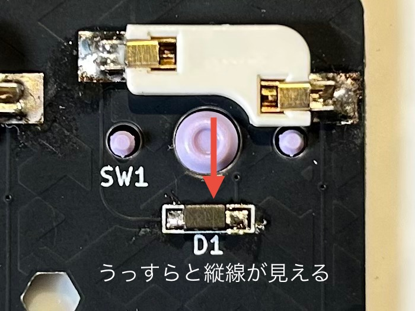

はんだ付け後、向きを確認したい時はこの画像を参考にしてください。特に注意すべきは四角く囲った部分です。他のダイオードと向きが反転しています。

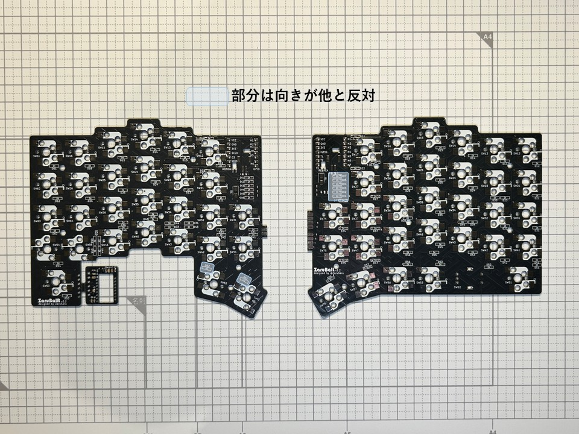
:::

<Steps>

1. ダイオード用のパッドのうち片方に予備はんだを盛ります。
2. 左手でピンセットを使いダイオードをつまみます。この時シルクの向きとダイオードの向きが揃っていることを確認します。
3. パッドに盛ったはんだをはんだごてで溶かしながら、ダイオードの位置を調整します。
4. ダイオードの位置が決まったらはんだごてをパッドから離し固定します。
5. 反対側のパッドにはんだを流します。
6. はじめにパッドに盛ったはんだは予備はんだなので固定力を高めるために再度ハンダを流し込みます。

</Steps>

この作業を全85個のダイオードで繰り返します。ハンダ漏れや向きの間違いに気をつけましょう。

### 3-2. スイッチソケットの実装

<Steps>

1. 片方のパッドに予備ハンダを盛ります。
2. ソケットをシルクの形に沿うように配置し、予備ハンダを溶かしながら基盤に密着するようにソケットを押さえつけます。ソケットの金属部分が加熱するのでピンセットなどで押さえつけることをおすすめします。
3. ソケットの反対側のパッドにハンダを盛ります。
4. 予備ハンダをしたパッドに再度ハンダを流します。

</Steps>

:::note[仕様ごとのソケットの違い]

MX互換仕様では親指クラスタのみchocソケット、その他はMXソケット

ロープロファイル仕様では全キーchocソケットとなります。

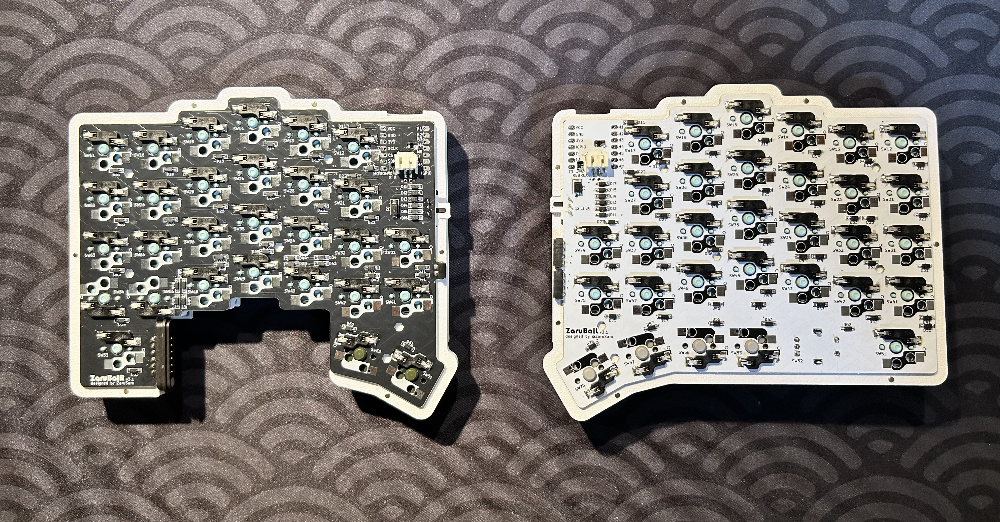

MX互換仕様の場合

ロープロファイル仕様の場合
:::

:::tip[各ソケットのシルク]

| スイッチの種類 | ソケットを配置する位置 |
| :------------- | :--------------------- |
| MXスイッチ     | 画像の下側のシルクの形 |
| Chocスイッチ   | 画像の上側のシルクの形 |

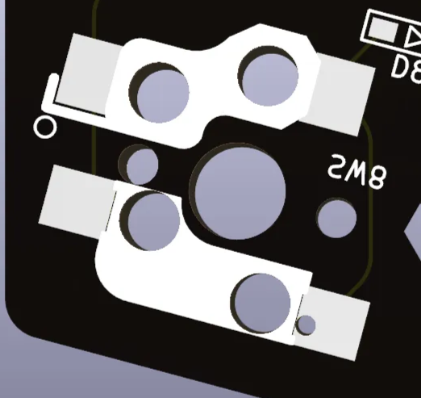

:::caution
MX, Choc両方のソケットを付ける事は可能ですが、その場合ガイドピン付きのchocスイッチは使用できません。ChocスイッチとMXスイッチを併用する方以外は両方のソケットのはんだ付けはしないことをお勧めします。
:::

### 3-3. 電源スイッチの実装

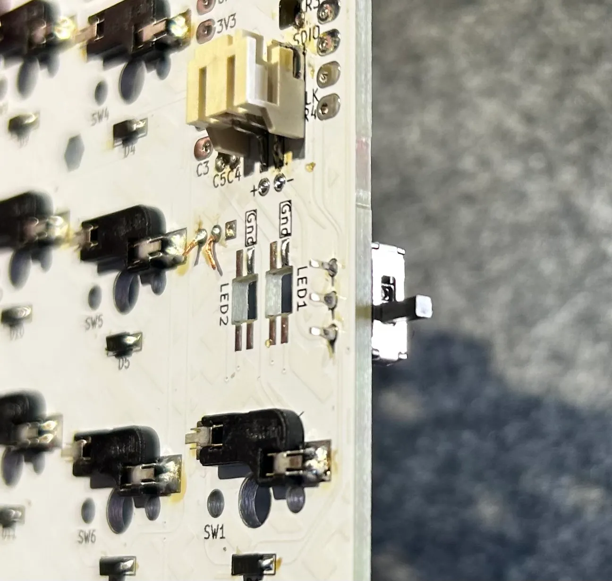

<Steps>

1. 基板表面からスイッチを差し込みます。
2. スイッチを基板に密着させたまま、ずれないようにマスキングテープで固定します。
3. 基盤裏面から3つのスルーホールにハンダを流します。
4. ハンダが固まったら、マスキングテープを剥がします。
5. ボトムケースとスイッチの足が干渉する時はニッパーで短く切ってください。

</Steps>

:::danger[スイッチは電源をオフに！]

スイッチは下方向に動かすと電源ONに、上方向でOFFとなります。安全のため、スイッチ取り付け後にOFFにしておきましょう。

:::

### 3-4. マイコンの実装

**マイコンの端面スルーホールのはんだ付け**

<Steps>

1. マイコンのスルーホールにピンヘッダを挿します。ピンヘッダはマイコンの片側に1つのみ挿入してください。また、このピンヘッダはガイドとして使用するためはんだ付けはしません。
2. マイコンを基板表面の所定の位置に配置してください。ピンヘッダを差し込み、基板とマイコンの位置が動かないようにしてください。また、基板としっかり密着している事を確認してください。
3. ピンヘッダ未装着側のマイコンの端面スルーホールをハンダ付けします。こて先を端面スルーホールに突き立てて、上側からハンダを流すときれいにハンダ出来ます。
   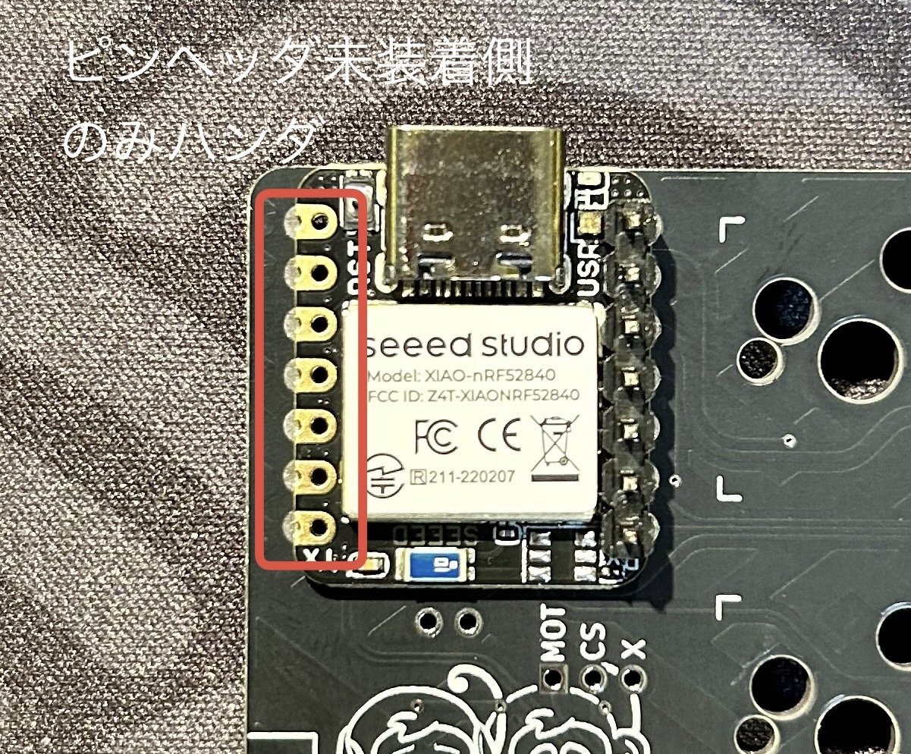
4. ピンヘッダを外し、もう片方の端面スルーホールも同様にはんだ付けします。ピンヘッダごとはんだ付けしないよう注意しましょう。
5. マイコン裏面のパッド3つをはんだ付けします。フラックスを塗付し、スルーホールにこて先を立てて、十分加熱した後開口部からハンダ線を差し込み、基板とマイコンが接する部分にハンダを流すとうまく行きます。金色のパッドが銀色のはんだでしっかり覆われている事を確認してください。

</Steps>

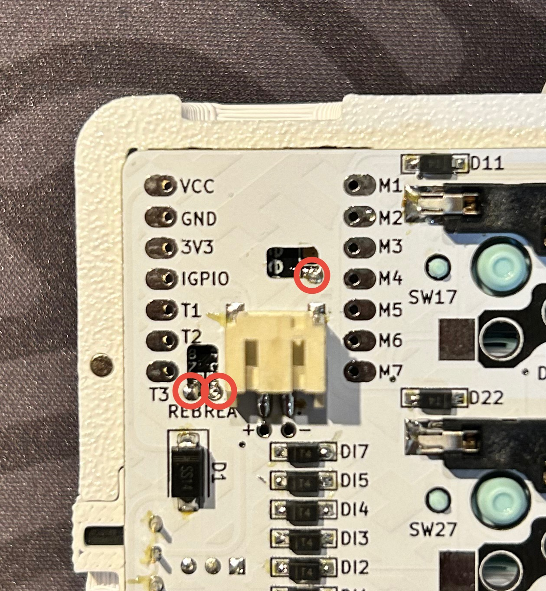

Kzさんのポストが動画付きでとても参考になるのでぜひご覧ください。

<LinkCard
  title="裏面パッドはんだ付け動画"
  href="https://x.com/kazu_dob/status/1904135222402146531"
/>

### 3-5. FPCのはんだ付け

:::note[Mack仕様のみ]
こちらのステップはMackオプションを購入された方のみ行ってください。Mackビルドガイドに記載すべきですが、他のパーツを組み付ける前にはんだ付けした方が楽なのでZaruBallのビルドガイドに記載しております。
:::

Senseモジュール用のパッドと基板をフレキシブル基板で接続します。

<Steps>

1. フレキシブル基板は複数の同じ基板が一枚にまとまっています。画像の赤丸の部分で繋がっているのでカッターで丁寧に切り取ってください。
   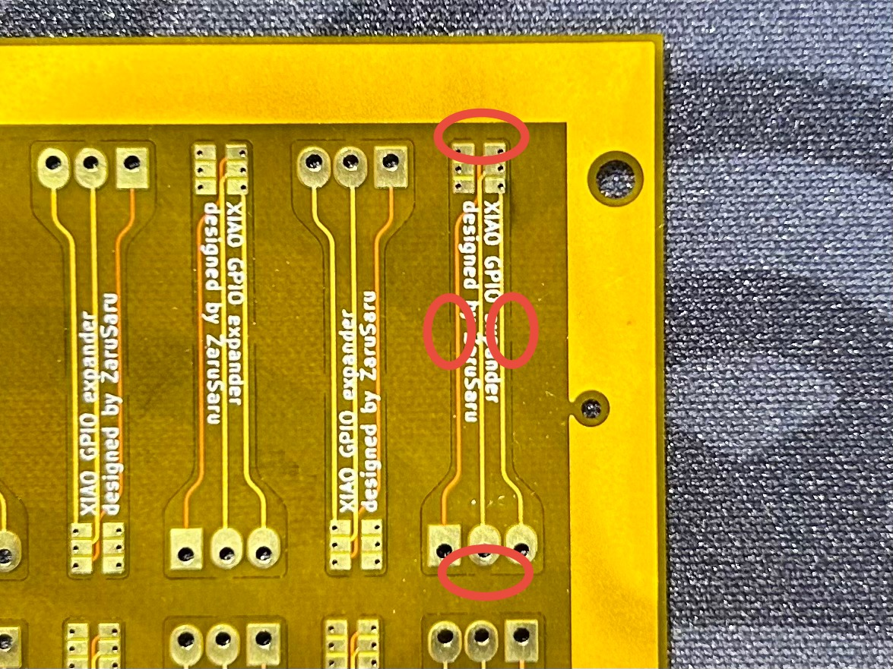

2. 左手側のXIAOの囲んだ位置のパッドにフラックスを塗り、呼びハンダを盛ります。

   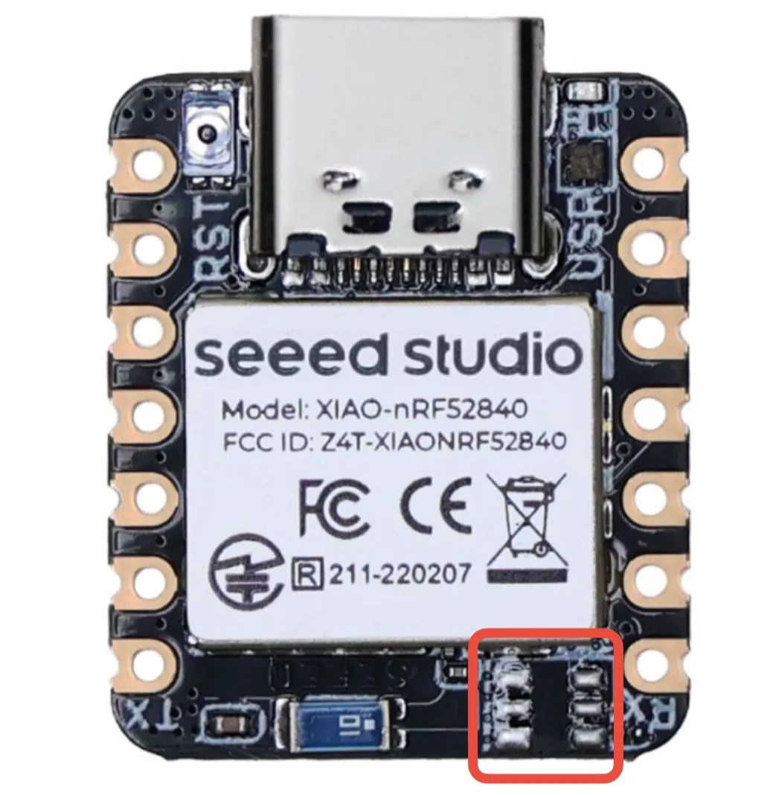

   四角で囲った6つのパッドがSenseモジュール用のパッドです

3. そこにフレキシブル基板を配置します。フレキに記載のシルクが正しく読める方が表面です。
4. フレキ上から軽くはんだごてを押し当てることで呼びハンダをフレキに流し込みます。
5. 固定されたら右側のパッド3つがショートしていないことをテスターで確認し、さらにハンダを盛ります。（左側のパッドはすべてGNDなので導通します）
6. もう一度テスターでショートしていないことを確認してください。
7. ピンヘッダを1本になるようにニッパーでカットしてください。
8. Senseパッドの下側にT5, X, T4と記載された3つのスルーホールの中央の穴にピンヘッダでフレキを固定します。
9. ピンヘッダの刺さっていないスルーホールをハンダで固定した後、ピンヘッダを抜きそのスルーホールもはんだ付けします。

</Steps>

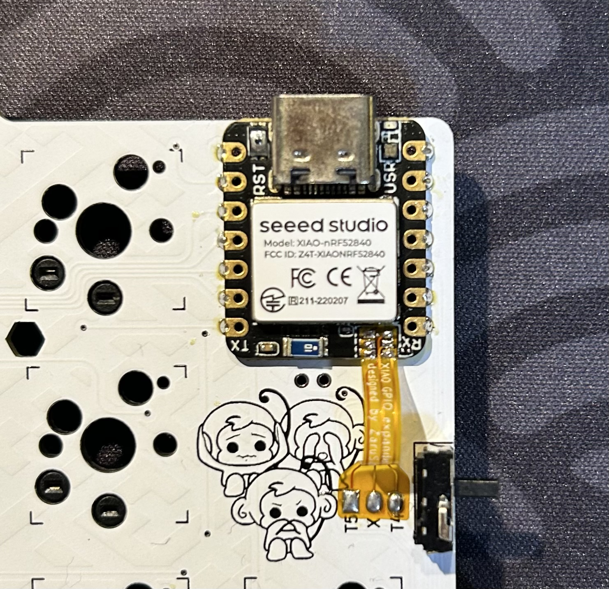

### 3-6. バッテリコネクタの実装

PHメスコネクタを基板に取り付けます。固定用の足2本と配線用の足2本をハンダづけします。

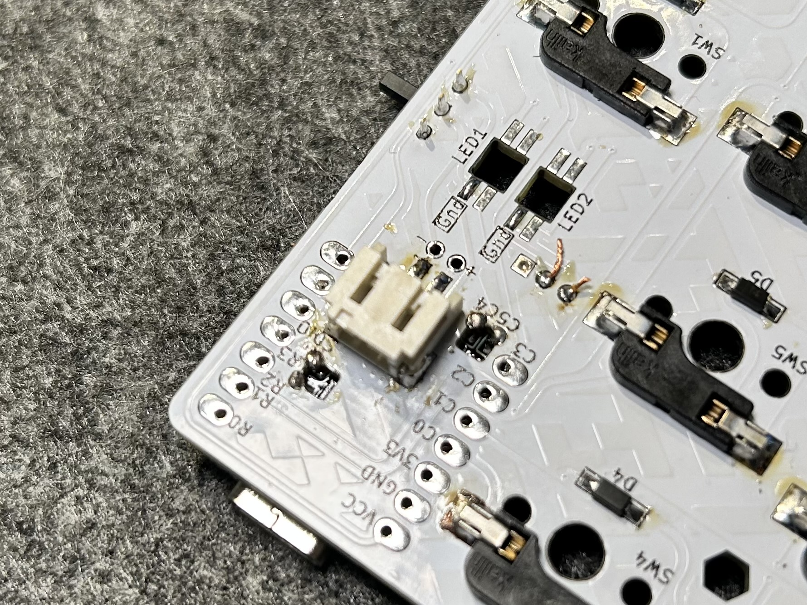

### 3-7. 右手側基板とトラックボール基板の分割

トラックボール基板と右手基板はつながっています。マウスバイトで簡単に切断できるようになっているので手で折るようにして分離してください。残った捨て基板はペンチでつかんで折ることによって切り離してください。最後に折った基板の断面をやすり掛けしてください。

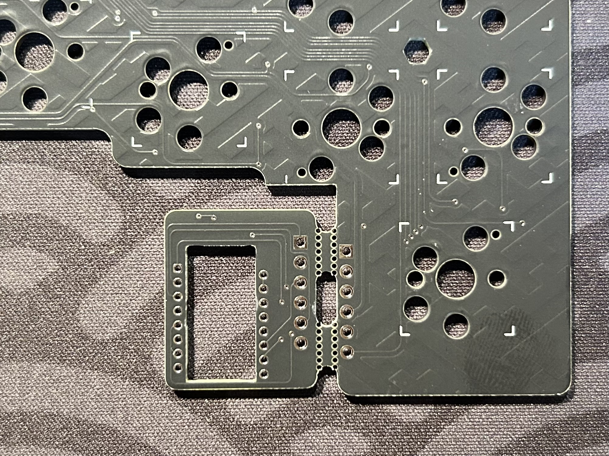

### 3-8. 右手側基板へのマグネットコネクタの実装

右手側基板にトラックボール基板と接続するためのマグネットコネクタを実装します。

:::caution[磁力に注意]
マグネットにこて先が吸い寄せられます。プラスチック部分にこて先が当たると溶けてしまうので注意してください。
:::

<Steps>

1. 基板表面からコネクタのL字ピンを差し込みます。この時、ピンの曲がった部分が基板に触れるまで深く差し込んでください。
2. コネクタが基板に対して垂直になるようにして、マスキングテープで固定します。
   基板の裏側から1本だけ足をはんだで固定します。
3. 再度横から見て垂直になっているか確認します。垂直になっていない時はハンダを溶かしながら角度を調整します。
4. 角度が決まったらすべての足をはんだ付けしてください。
5. 基板からのでっぱりがコネクタの下端以下になるようにニッパー切ってください。

</Steps>

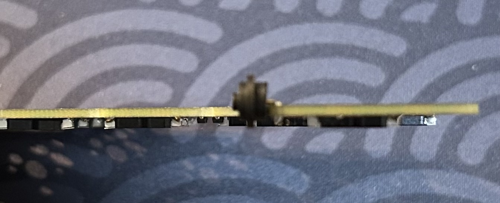

### 3-9. トラックボール基板の組立

<Steps>

1. レンズを外してから画像の向きでpmw3610をトラボ基板に差し込んでください。
   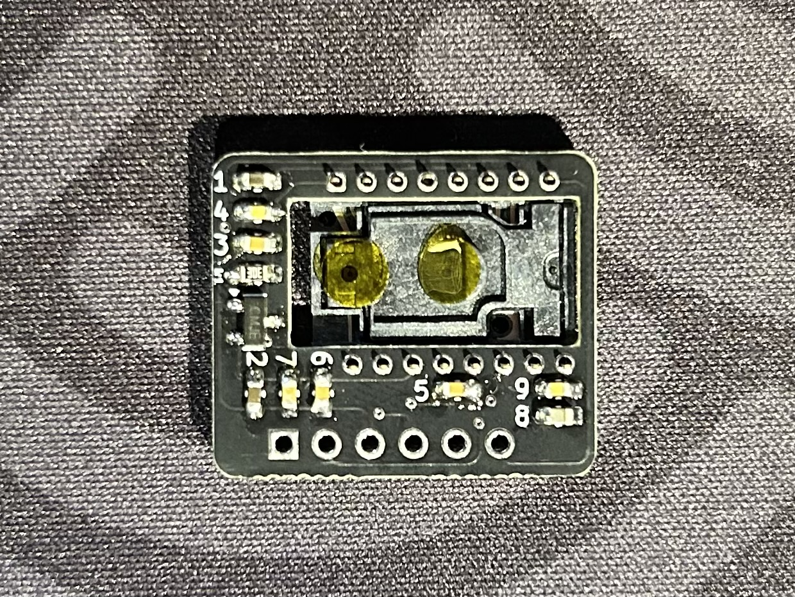
2. 基板と光学センサ―が密着するようにしてマスキングテープで固定し、すべての足をはんだ付けします。センサーは熱に弱いので適宜冷ましながらはんだ付けしてください。
3. I字マグネットコネクタ―を基板にはんだ付けします。
   表面実装部品の無い基板面からコネクタを差し込み、6本の足をハンダ付けします。マグネットにこて先が吸い寄せられないよう気をつけてくさい。

   :::note[マグネットコネクタの向き]
   マグネットコネクタが吸着する向きは決まっています。基板に実装したL字コネクタと繋げてみて、適切な向きとなるようにしてください。

   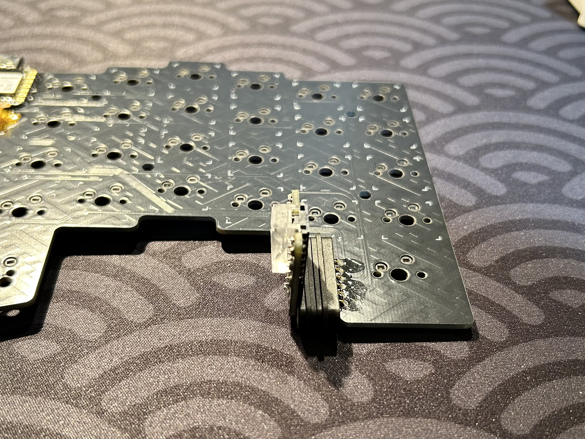

   :::

4. 光学センサーの保護シートをはがします。画像の半透明の黄色いシートが保護シートです。

   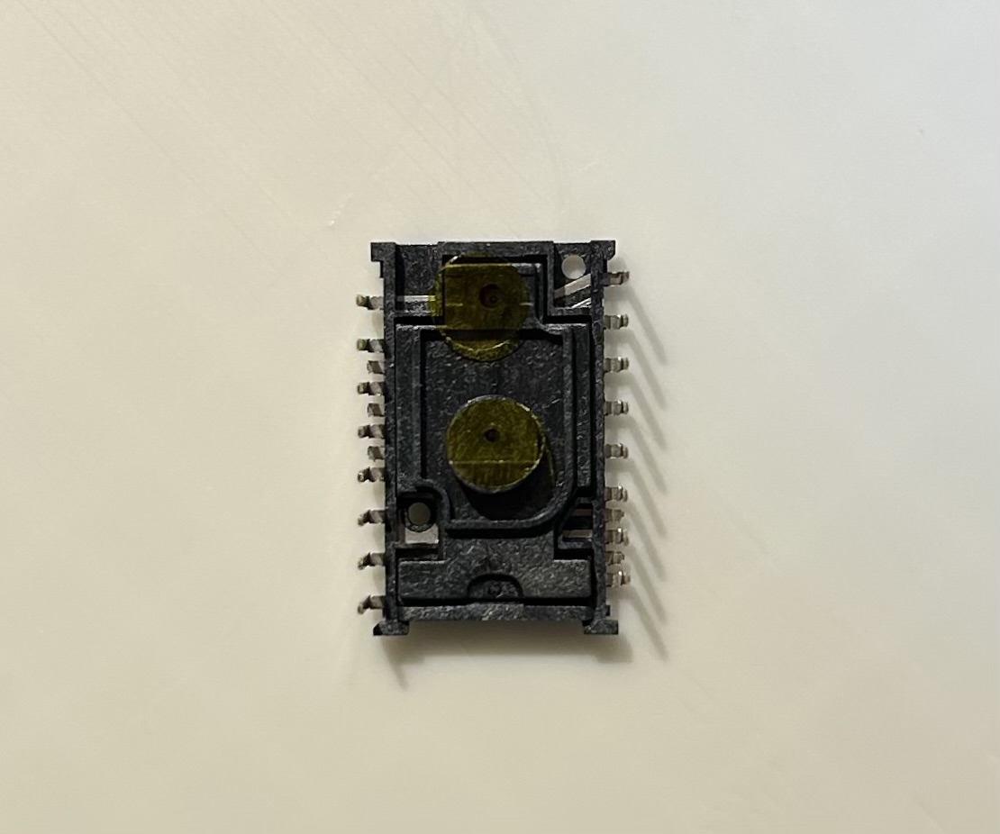

5. レンズを装着します。そして、裏面のレンズのでっぱりをはんだごてで溶かして潰し、レンズをセンサー本体に固定します。210度ほどで溶かすときれいにつぶせます。

</Steps>

### 3-10. ロータリーエンコーダの実装

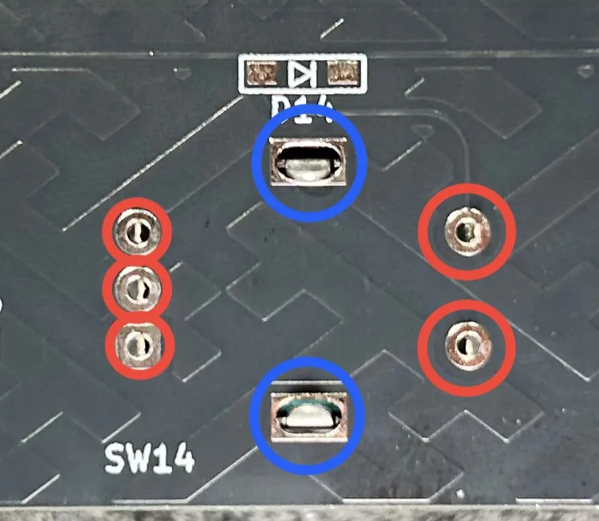

左手基板にEC11互換のロータリーエンコーダをはんだ付けします。

<Steps>

1. 基板の表面からロータリーエンコーダを差し込みます。
2. 画像の赤丸のスルーホールをはんだ付けします。(ロープロファイル版に同梱のプッシュスイッチ無しのものは右側の2ピンはありません)
3. 青丸の足は電気的接続のいらない固定用のものです。ペンチなどで曲げたり、ハンダで固定してください。

</Steps>

### 3-11. マイコンへのファームウェア書き込み

<Steps>

1.  GitHubから初期ファームウェアをダウンロードします。init_firmwareフォルダに必要なデータが揃っています。

    <LinkButton
      href="https://github.com/ImSota/zmk-config-ZaruBall/tree/ZaruBall-v3.x/init_firmware"
      icon="download"
    >
      標準ファームウェア
    </LinkButton>

        :::note[各データの説明]

        フォルダの中には3つのファイルがあり、それぞれ左右のマイコンに書き込むためのものと不具合時に使用するものとなっています。

        | ファイル名                                               | 説明                                     |
        | -------------------------------------------------------- | ---------------------------------------- |
        | ZaruBall_right rgbled_adapter-seeeduino_xiao_ble-zmk.uf2 | 右手側のマイコンに書き込むファームウェア |
        | ZaruBall_left rgbled_adapter-seeeduino_xiao_ble-zmk.uf2  | 左手側のマイコンに書き込むファームウェア |
        | settings_reset-seeeduino_xiao_ble-zmk.uf2                | 不具合発生時に使用するファームウェア     |

        :::

        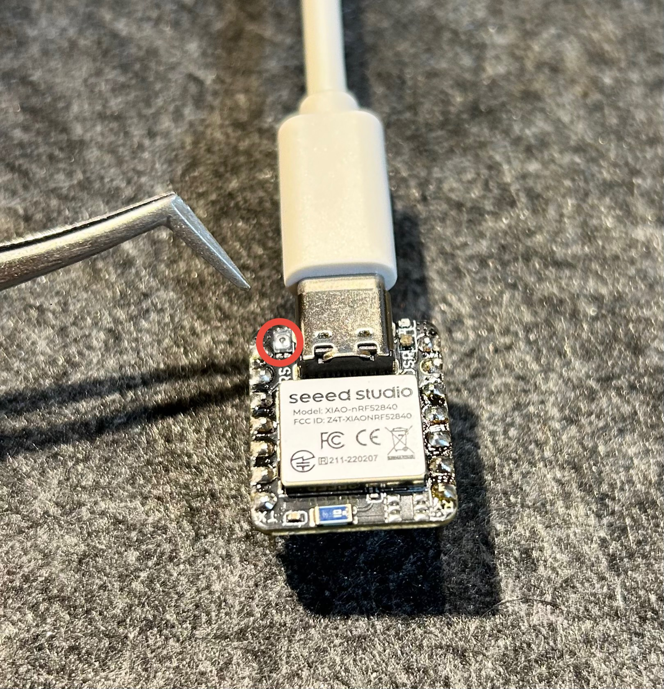

2.  左手側のマイコンをPCとUSB接続します。図中に赤丸で示したスイッチがリセットスイッチです。これをピンセットなどで2回連続で素早く押すことでブートローダーモードに入ります。こうすることでドライブとしてPCに認識されるので、エクスプローラーに表示されるXIAO-SENSEを開きます。
3.  そこにダウンロードした左手用のuf2ファイルをドラッグアンドドロップでコピーします。コピー完了後、エラーが出ることがありますが問題ないので無視して構いません。コピー後はマイコンからUSBは抜いてしまってOKです。
4.  同様の操作で右手側のマイコンには右手用のuf2ファイルを書き込んでください。

    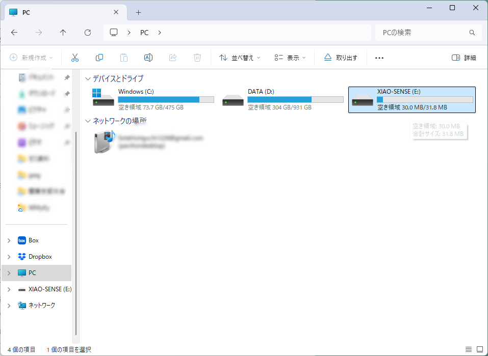

</Steps>
