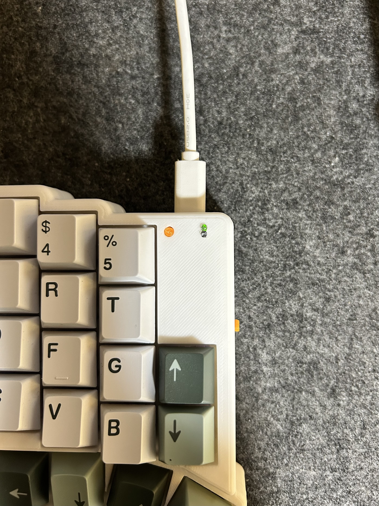

import { Card, CardGrid, LinkButton } from "@astrojs/starlight/components";

## Bluetooth接続のトラブルシューティング

インジケータランプの光り方である程度原因が推測できます。

電源オン時にランプが2回光ります。

1回目の発光は充電残量を表します

| 発光色 | 意味                   |
| ------ | ---------------------- |
| 緑     | 充電残量60%以上        |
| 黄     | 充電残量30%以上60%未満 |
| 赤     | 充電残量10%以上30%未満 |
| 赤点滅 | 充電残量10%未満        |

2回目の発光は接続状況を表します

| 発光色 | 右手側の意味     | 左手側の意味           |
| ------ | ---------------- | ---------------------- |
| 青     | Bluetooth接続済  | 右手キーボードと接続済 |
| 黄     | ペアリングモード | ——                     |
| 赤     | Bluetooth未接続  | 右手キーボードと未接続 |

### 事例1: 電源オン時にインジケータランプが光らない

バッテリーの充電不足が考えられます。USB充電器に接続してください。充電は電源オン時のみ行われます。充電時はインジケータの上側のランプが淡く緑色に光ります。

バッテリー充電中は暗所で確認すると淡く光ることが確認できます

### 事例2: 充電ランプが点灯しない

事例1で充電を試して、充電ランプが点灯しない場合はバッテリー回路でのハンダ不良が考えられます。
下記パーツのはんだを確認してください。

- PHコネクタ
- 電源スイッチ
- マイコンのGNDピンと裏面パッドのBAT+ピン

### 事例3: デバイスのBluetooth機器接続画面にZaruBallが表示されない

<CardGrid>
  <Card title="原因1: ペアリングモードに入っていない" icon="seti:smarty">
    キーボードがペアリングモードに入っていない可能性があります。layer3(adjust
    layer)のBT_CLRキーによりペアリングモードに入れます。
  </Card>
  <Card title="原因2: 有線モードになっている" icon="seti:smarty">
    充電中などに有線接続されていると判断して、有線モードになる場合があります。layer3(adjust
    layer)のOUT_TOGキーを押すと、有線モードと無線モードをトグル切り替え出来ます。
  </Card>
</CardGrid>
どのキーを押すかは[標準ファームウェアのキーマップ](/ZaruBallv3-docs/build-guide/keymap-guide/#layer-3--adjust_layer)をご参照ください

### 事例4: 左手キーボードが右手キーボードと接続できない

左右のキーボードに一度リセットファームウェアを書き込んでから再度通常のファームウェアを書き込んでください。

ZMKのDocsを参照してください。

<LinkButton
  href="https://zmk.dev/docs/troubleshooting/connection-issues#reset-split-keyboard-procedure"
  variant="secondary"
  icon="external"
>
  Reset Split Keyboard Procedure
</LinkButton>

## キー入力のトラブルシューティング

一部/全部のキーが入力できない！という問題に悩んでいる場合はこちらのツールをご使用ください。

ZaruBallv3用のGithubリポジトリURL<code>https://github.com/ImSota/zmk-config-ZaruBall/tree/ZaruBall-v3.x</code>
を入力し、表示されたレイアウトから不能なキーを選択することではんだ付けに問題のある個所を推測してくれます。

<LinkButton
  href="https://imsota.github.io/ZaruBall-debug-webpage/"
  variant="secondary"
  icon="external"
>
  ZMK Key Matrix Diagnoser
</LinkButton>
