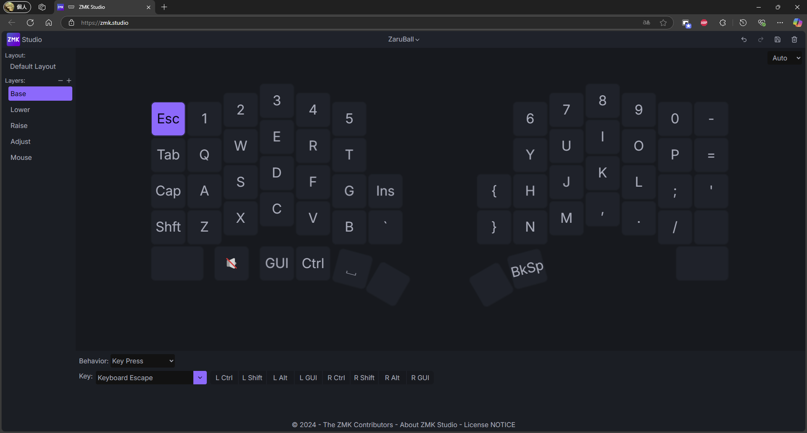
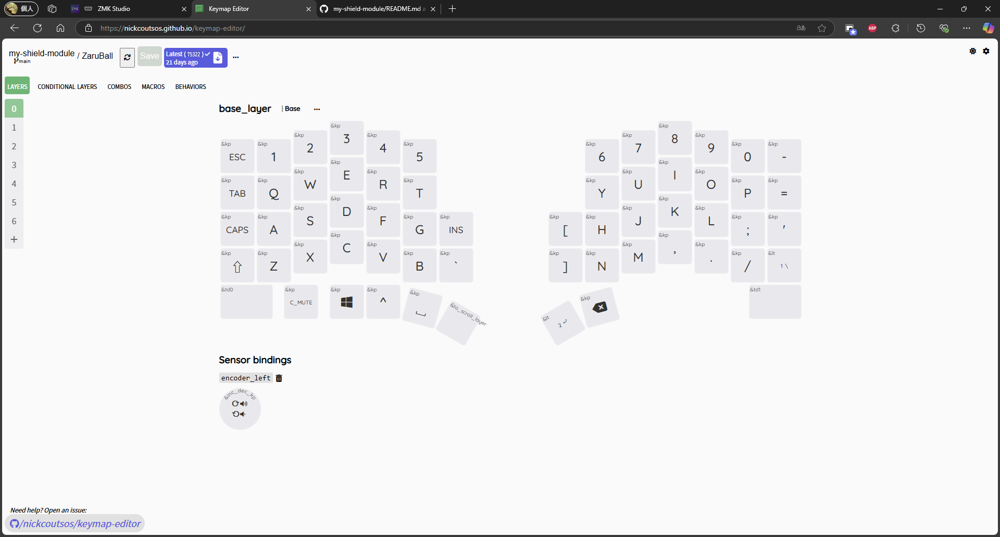
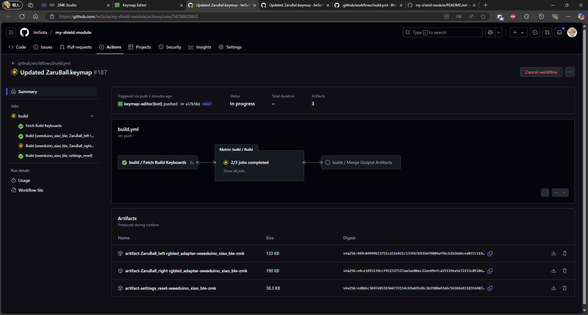
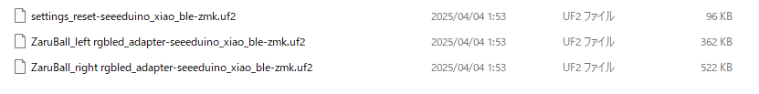

import { Steps, LinkButton } from "@astrojs/starlight/components";

:::caution[注意事項]
ZMKのファームウェアをGithub上で管理・ビルドする場合、第三者からキーマップや各種設定が閲覧できるようになります。マクロ等に個人情報（メールアドレス、住所、氏名、パスワード）を登録するのはおやめください。
:::

## ZMKにおける3つのキーマップの編集方法

ZMKではキーマップの変更を簡単に行うツールが二つあります。また、直接設定ファイルを書き換えてキーマップを編集する方法もあります。それぞれの特徴を以下に示します。

|                          | メリット                                                            | デメリット                                                               | 難易度 | 設定の自由度 |
| ------------------------ | ------------------------------------------------------------------- | ------------------------------------------------------------------------ | ------ | ------------ |
| ZMK Studio               | Bluetooth経由でビルドせずともキーマップ書き換え可能（アプリ版のみ） | 多彩なZMKの機能が使用できない（Combo, Macroなど）                        | 低     | 低           |
| keymap editor            | ほとんどのZMKの機能が使用できる                                     | ビルドしてUSB接続経由でファームウェアをキーボードに書き込む必要がある    | 中     | 中           |
| 直接設定ファイル書き換え | トラックボールの動作の変更も行える、すべてのZMK機能を使える         | コードを書き換えるため、ZMKの知識が必要、ビルドとUSB経由の書き込みが必要 | 高     | 高           |

### ZMK Studio

まずは設定が簡単なZMK Studioから使用してみましょう。

<Steps>

1.  リンクを開くと、キーボードと接続するように指示されます。USB→ZaruBallを選択してください。

    <LinkButton href="https://zmk.studio/" variant="secondary" icon="external">
      ZMK Studio
    </LinkButton>

2.  ZMK Studioと接続するためにはキーボードをUnlockする必要があります。初期キーマップではレイヤー1（Lower）の右手小指最下段の1.5uキーにてUnlockできます。

3.  Unlockすると、以下のような画面に遷移します。左のタブから編集したいレイヤーを選択します。

    

    :::tip[TIPS]
    レイヤーは+ボタンで最大2つ増やすことができるよう設定しています。
    もっとレイヤーが欲しいという方は増やしてみてください。
    :::

4.  画面内のキーボードから変更したいキーを押します。

5.  下のBehaviorとKeyにて選択したキーに割り当てる動作を指定します。

    Behaviorは動作の種類を示しています。一般的なキー入力にはKey Pressを選択して下さい。
    その他、多用するBehaviorは以下の通りです。

    | Behavior         | 説明                                                         |
    | ---------------- | ------------------------------------------------------------ |
    | Key Press        | 一般的なキー入力                                             |
    | Transparent      | ひとつ上のレイヤーのキーと同じ動作を割り当て                 |
    | None             | キーの無効化                                                 |
    | Momentary Layer  | キーを押している間だけ指定したレイヤーに移動する機能         |
    | Layer-Tap        | 長押しでMomentary Layer、短押しで指定したKey Pressに割り当て |
    | Mod-Tap          | 長押しと短押しで異なるキー入力に割り当て                     |
    | Bluetooth        | 接続先切り替え、接続情報のクリアなどのキー割り当て           |
    | Output Selection | USB接続とBluetooth接続の切り替え                             |
    | Studio Unlock    | ZMK Studioに接続するためのUnlock                             |
    | ind\_ bat        | バッテリー残量をLEDの色で通知                                |
    | ind_con          | 接続状況をLEDの色で通知                                      |

6.  キーマップ編集が完了したら右上の保存マークで保存してください。キーボードで変更したキーマップが有効になります。

</Steps>

:::note[ZMK Studioはアプリケーション版とブラウザ版があります]
ブラウザ版ではcentral側（PCと通信する側、ZaruBallでは右手側のキーボード）をPCとUSB接続することでキーマップを編集できます。

対して、アプリケーション版はBluetooth接続でも編集できます。

以下のリンクからダウンロードしてください(Windows, macOS, Linux)

<LinkButton
  href="https://zmk.studio/download"
  variant="secondary"
  icon="external"
>
  ZMK Studio - Download
</LinkButton>
:::

### keymap editor

もっと細かく設定したい！ComboやMacroも使いたい！という方はkeymap editorに挑戦しましょう。

<Steps>

1.  まずはZaruBallファームウェアリポジトリをご自身のアカウントにフォークしてください。複数ブランチがありますが、ZaruBallv1.x〜2.xの方はmainブランチを、v3.xの方はZaruBall-v3.xをご利用ください。

    <LinkButton
      href="https://github.com/ImSota/zmk-config-ZaruBall/tree/ZaruBall-v3.x"
      variant="secondary"
      icon="github"
    >
      GitHub - zmk-config-ZaruBall
    </LinkButton>

2.  以下のリンクからkeymap editorにアクセス。Githubを選択し、ご自身のGithubにログインしてフォークしたZaruBallのファームウェアリポジトリを選択してください。

    <LinkButton
      href="https://nickcoutsos.github.io/keymap-editor/"
      variant="secondary"
      icon="external"
    >
      Keymap Editor
    </LinkButton>

3.  以下の画面がでたら、キーマップの変更を行います。基本的な操作はZMK Studioと同様です。

    

4.  ZMK Studioでは使えない機能は上のタブにあるCombos, Macros , 自由に設定できるBehaviorなどがあります。画面の指示に従って変更してください。

5.  設定が完了したら左上のSaveボタンにてGithubリポジトリにpushできます。

6.  Saveボタン隣の青色のボタンを押すと、変更したキーマップを元に実行されているWorkflowの画面に移動します。

    

    :::note[Workflowとは？]
    ZMKはGithub Actionsにてファームウェアのビルドを行うことができます。ファームウェアの設定を変更したら毎回Workflowが自動的に実行され、ビルドしてくれます。
    :::

7.  ビルドが完了すると、画面下部のArtifactsにファイルが生成されます。右のダウンロードボタンで保存してください。

8.  ダウンロードしたファイルを解凍すると、3つのファイルがあります。

    

    | ファイル名                                               | 説明                                     |
    | -------------------------------------------------------- | ---------------------------------------- |
    | ZaruBall_right rgbled_adapter-seeeduino_xiao_ble-zmk.uf2 | 右手側のマイコンに書き込むファームウェア |
    | ZaruBall_left rgbled_adapter-seeeduino_xiao_ble-zmk.uf2  | 左手側のマイコンに書き込むファームウェア |
    | settings_reset-seeeduino_xiao_ble-zmk.uf2                | 不具合発生時に使用するファームウェア     |

9.  左右のキーボードにファームウェアを書き込んでください。

    書き込み方は以下からご確認ください。

    <LinkButton
      href="../../build-guide/solder/#3-11-マイコンへのファームウェア書き込み"
      variant="secondary"
      icon="external"
    >
      ファームウェア書き込み手順
    </LinkButton>

</Steps>

### 直接設定ファイルを書き換え

より細かく設定を変えたい場合は、ソースコードを書き換える必要があります。

本章では需要が高いであろう、トラックボールのCPIの変更方法について説明します。

~~1. フォークしたZaruBallファームウェアリポジトリのconfig/ZaruBall.confを開いてください。~~ \
~~2. 以下の行を追加、既にある場合は数値を変更し、CPIを設定してください。~~

```c
// CONFIG_PMW3610_CPI=1800
```

上記手順ではビルドが通らなくなっているので、ご紹介する以下の手順で対応してください。

<Steps>

1.  フォークしたZaruBallファームウェアリポジトリの `boards/shields/ZaruBall/ZaruBall.dtsi` を開きます。

2.  205行目付近にある `cpi` の数値を変えてください。

    ```c
    cpi = <600>; // -> cpi = <1800>; などに変更
    ```

3.  リポジトリにpushすると、自動的にworkflowが実行されます。Actionタブからworkflowの様子を確認できます。

4.  workflow完了後、作成されたファームウェアをキーボードに書き込んで動作を確認してください。

</Steps>

さらに細かく設定したい方はZMK Docsをご確認ください。

<LinkButton href="https://zmk.dev/docs" variant="secondary" icon="external">
  Introduction to ZMK | ZMK Firmware
</LinkButton>
