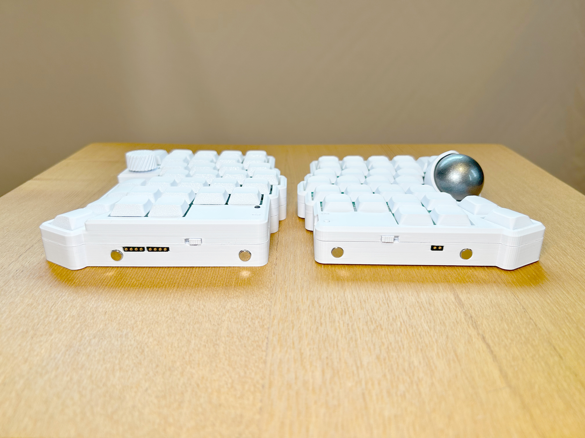
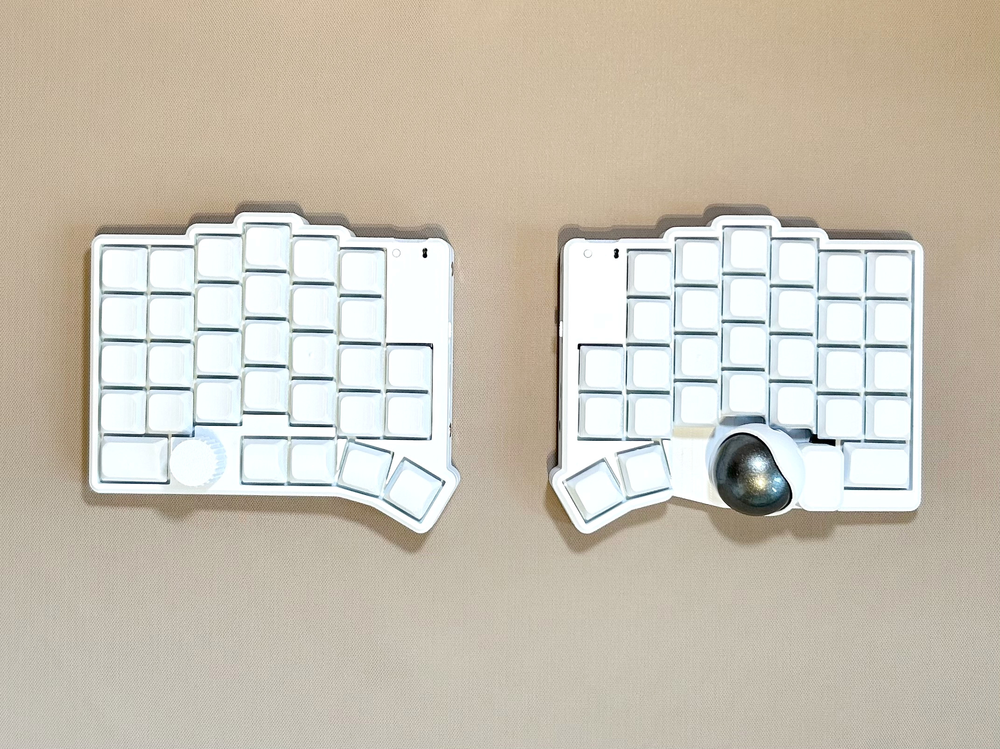
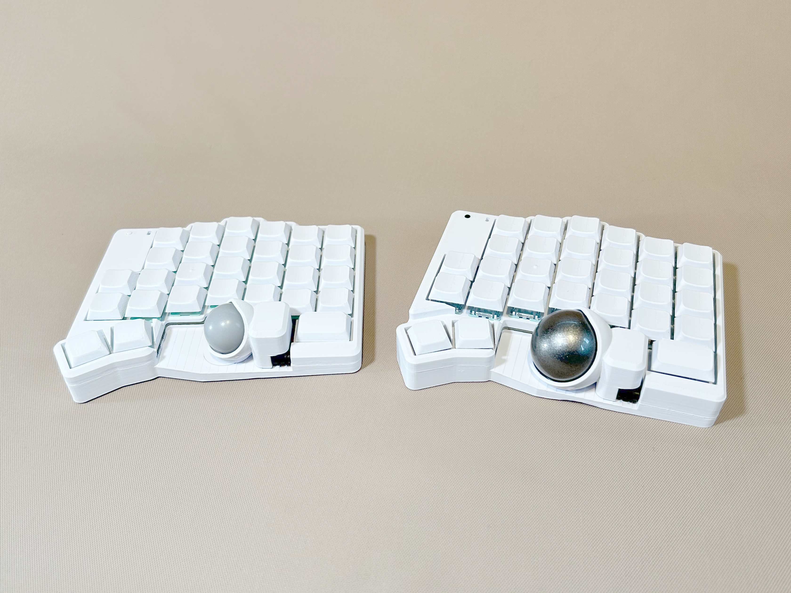
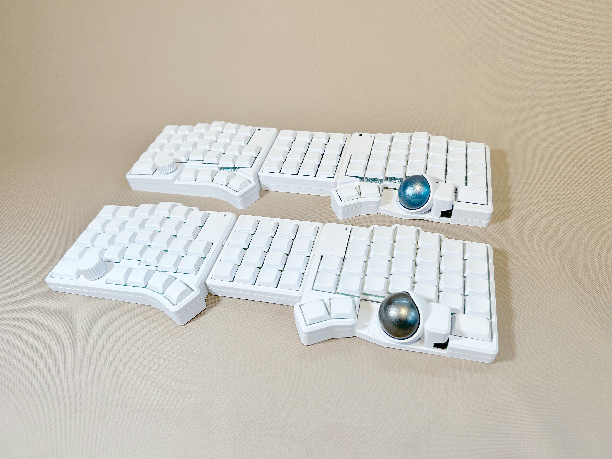
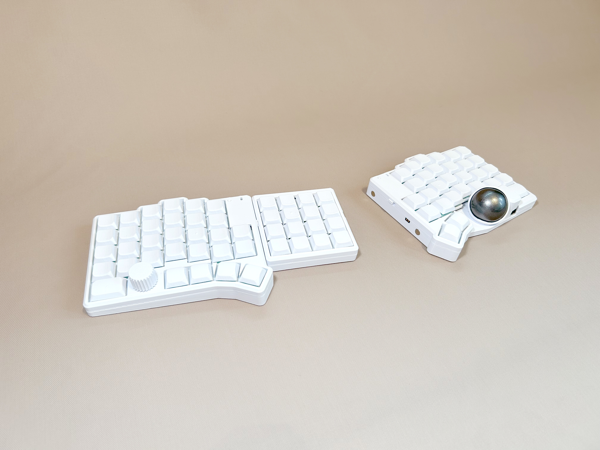
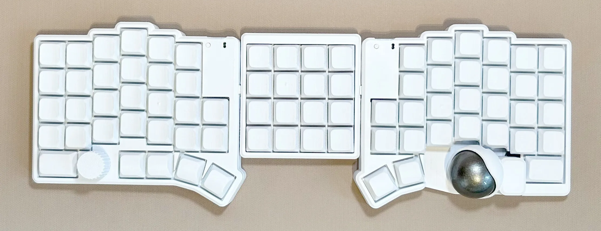
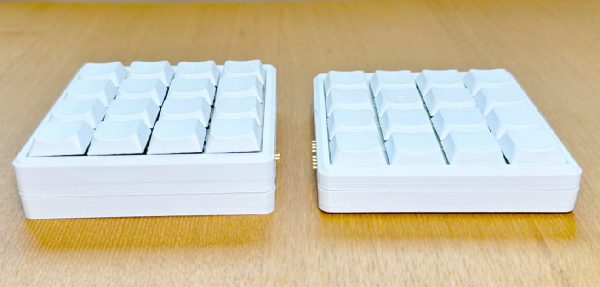
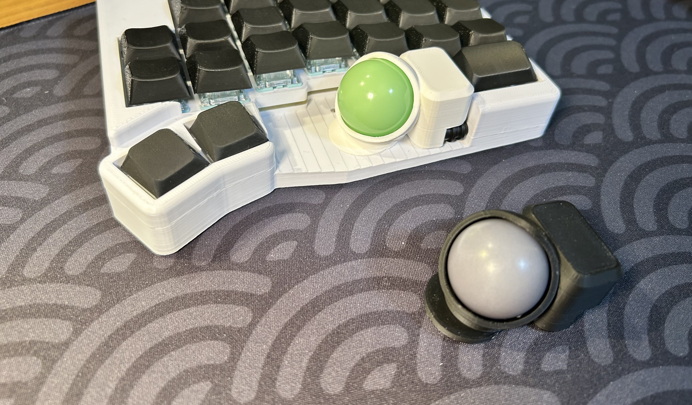

import { Card, CardGrid, LinkCard } from "@astrojs/starlight/components";
import CustomCard from "../../components/CustomCard.astro";
import Keycap from "~icons/glyphs/keycap-bold";
import Trackball from "~icons/fluent-emoji-high-contrast/pool-8-ball";
import Keyswitch from "~icons/arcticons/hvv-switch";
import Firmware from "~icons/ix/firmware";
import Keyboard from "~icons/proicons/keyboard";
import Tenkey from "~icons/icon-park-solid/keyboard";
import Carousel from "../../components/Carousel.astro";

## 特徴

<CardGrid>
  <CustomCard title="60% Keyboard">
    <Keycap slot="icon" color="white" font-size="1.5rem" aria-hidden />
    ZaruBallは60%キーボードです。 数字列はやっぱりあったほうがいいよね。
  </CustomCard>
  <CustomCard title="34mm/25mm Trackball">
    <Trackball slot="icon" color="white" font-size="1.5rem" aria-hidden />
    トラックボールは34mmと25mmの2種類から選べます。高さを抑えることでキー入力中の誤動作を最小限に。
  </CustomCard>
  <CustomCard title="Choose favorite switches">
    <Keyswitch slot="icon" color="white" font-size="1.5rem" aria-hidden />
    MXスイッチとchocスイッチの2種類から選べます。ホットスワップ対応なのではんだ付け不要で交換可能です。
  </CustomCard>
  <CustomCard title="ZMK Firmware">
    <Firmware slot="icon" color="white" font-size="1.5rem" aria-hidden />
    ZMKの採用により完全無線での使用が可能です。
  </CustomCard>
  <CustomCard title="Customizable Case">
    <Keyboard slot="icon" color="white" font-size="1.5rem" aria-hidden />
    3Dプリントによりケースの色を自由に変更可能です。また、モデルを改変して自分好みの形に変えることもできます。
  </CustomCard>
  <CustomCard title="Mack Option">
    <Tenkey slot="icon" color="white" font-size="1.5rem" aria-hidden />
    Mackオプションを付けることで、左右キーボードの同時充電と16個のキーの追加が可能です。
  </CustomCard>
</CardGrid>

## ギャラリー

<Carousel>

</Carousel>

## オプションパーツ

### Mack

16キーマクロパッドと充電ドック機能を搭載したMack(Macro+Dock)

import Charge from "~icons/bi/lightning-charge-fill";

<CardGrid>
  <CustomCard title="充電機能">
    <Charge slot="icon" color="white" font-size="1.5rem" aria-hidden />
    MackをUSB充電器に接続し、左右のキーボードの間に挟むよう配置することにより左右のキーボードを同時に１本のケーブルで充電可能。
    接続はマグネットポゴピンで容易に脱着できます。
  </CustomCard>
  <CustomCard title="マクロパッド">
    <Keycap slot="icon" color="white" font-size="1.5rem" aria-hidden />
    左手側キーボードと接続することで、16キー搭載のマクロパッドとして機能します。
    テンキーやショートカットキーとして活用できます。
    (単体ではマクロパッドとして機能しません。Mack搭載のUSBコネクタは充電専用です。)
  </CustomCard>
</CardGrid>

 

  <video controls width="100%" muted loop autoplay playsinline>
    <source src="Mack_explanation.mp4" type="video/mp4" />
    お使いのブラウザは動画タグをサポートしていません。
  </video>

  
  
    左: MX互換仕様　右: ロープロファイル仕様
  

### 25mmトラックボールケース

  

  ZaruBall標準付属の34mmトラックボースケース以外にも25mmトラックボールが使用できます。
  マグネットでキーボードと固定されており、簡単に取り換えることができます。
  ZaruBallv3より前のものよりケース部の背が低くなり、手のひらに当たりにくい形となりました。
  25mmボールは付属しないので別途購入をお願いいたします。ZaruBallではshakupanさん販売のボールでの動作を確認済みです。

  <LinkCard
    title="25mm トラックボール (Booth)"
    description="動作確認済みの25mmトラックボールはこちら"
    href="https://shakupan.booth.pm/items/6457643"
    target="_blank"
  />
  

  

import { Steps } from "@astrojs/starlight/components";

## 価格

:::caution[在庫状況]
現在、在庫、予約分共に**売り切れ**です。
次回の入荷の連絡はX上で行うのでフォローしてお待ちください。
2月中には20台頒布する予定です。
:::

| 名称                               | 金額     | 在庫数(2/10 10:04) | 予約注文残数 |
| ---------------------------------- | -------- | ------------------ | ------------ |
| ZaruBallキット(ホワイト)           | 20,000円 | 0                  | 0            |
| Mackキット(ホワイト)               | 5,000円  | 0                  | 0            |
| 25mmトラックボールケース(ホワイト) | 1,000円  | 在庫制限なし       | 在庫制限なし |
| ZaruBallはんだ付けオプション       | 15,000円 | 在庫制限なし       | 在庫制限なし |
| Mackはんだ付けオプション           | 5,000円  | 在庫制限なし       | 在庫制限なし |

## 購入方法

<Steps>

1. **注文フォームの入力**

   リンクから**注文フォーム**にアクセスし、以下の項目を入力して送信してください。
   注文受付期間外は入力できません。
   Xでの告知をお待ちください。

   <LinkCard
     title="ZaruBall注文フォーム"
     description="Googleフォームから注文を受け付けています"
     href="https://docs.google.com/forms/d/e/1FAIpQLScr75F814yHidToD77OpEvKWxmbilALMaQznUVGnWbrJB54zg/viewform?pli=1&pli=1"
     target="_blank"
     icon="document"
   />

   | 項目                 | 説明                                                                             |
   | :------------------- | :------------------------------------------------------------------------------- |
   | **メールアドレス**   | 自動返信や発送のご連絡に使用します。                                             |
   | **お名前（漢字）**   | 発送および入金確認用です。                                                       |
   | **郵便番号・ご住所** | 商品のお届け先です。正確にご入力ください。                                       |
   | **X (Twitter) ID**   | （任意）メール付着等のトラブル時に、予備の連絡手段として使用する場合があります。 |
   | **希望商品**         | ご希望の商品を選択してください。                                                 |
   | **お支払い方法**     | 「銀行振込」または「PayPay」を選択してください。                                 |

2. **受付確認（在庫・予約について）**

   送信後、在庫状況に応じて事務局側で確認を行い、ステータスに応じたメールが届きます。
   - **在庫がある場合**: そのまま商品を確保します。
   - **在庫がない場合**: 「予約」として承ります。部品の調達・製造完了までお待ちいただく場合があります。

   :::note
   在庫状況は常に変動しており、フォーム送信時点では確定しておりません。確定メールをお待ちください。
   :::

3. **お支払い**

   在庫確保後（または予約商品完成後）、お支払い金額と送金先情報を記載した「請求メール」をお送りします。
   メール受信後、案内に従ってお支払い手続きをお願いいたします。

   :::caution[お支払い時の注意事項]
   トラブル防止のため、以下の点にご協力をお願いいたします。

   **🏦 銀行振込**
   - **振込依頼人名**: 必ず**ご注文時の「お名前」**を入力してください。
   - ※お名前の変更ができない場合は、任意の単語で振り込み手続きを行った上で、単語をメール返信にてお知らせください。

   **📱 PayPay送金**
   - **送金種別**: 「PayPayマネー」での送金をお願いします。
     - ⚠️「PayPayマネーライト」は使用しないでください。
   - **送金後の連絡**: 送金手続き完了後、届いたメールへの返信にてあなたのPayPay IDをお知らせください。
     :::

4. **発送**
   - **発送方法**: 基本的に**クリックポスト**（日本郵便 / 追跡あり・ポスト投函）にて発送します。
   - **発送時期**: 入金確認後、順次発送作業を行います。
   - **完了連絡**: 発送完了後、追跡番号（問い合わせ番号）をメールにてお知らせいたします。

5. **キャンセル・変更**
   - ご注文後のキャンセルや変更をご希望の場合は、届いたメールへの返信、または X (Twitter) DM等で速やかにご連絡ください。
   - 発送完了後のキャンセルはお受けできませんのでご了承ください。

</Steps>

## 注意事項

:::danger[購入前に必ずご確認ください]

- **はんだ付けが必要**：本キットははんだ付けが必要です。マイコン、ダイオード、ソケット、電源スイッチとコネクタ類は自身ではんだ付けをお願いいたします。
  ※はんだ付けが難しいという方のために発送までお時間が掛かりますが、組み立て代行のオプションも用意しております。希望されるキットと一緒にご購入下さい。
- **同梱しない部品**：トラックボール、スイッチ、キーキャップは付属しません。ご自身でご購入下さい。
- **オプションについて**：25mmトラックボールケースとMackはオプションとなります。別途料金がかかることをご留意ください。
- **同時給電禁止**：Mack使用時にZaruBall側のUSB端子とMack側のUSB端子への同時給電はおやめください。逆流防止回路を組み込んでいますが、最悪故障の原因となります。
- **バッテリーの取り扱い**：LiPoバッテリーの取り扱いには十分注意してください。バッテリーを因とする不具合、事故の責任は負いかねます。
- **発送時期**：在庫がある状態でも発送まで1週間程度頂きますがご了承ください。（はんだ付けオプションご利用時はさらに2-3週間程度頂きます）
  :::
